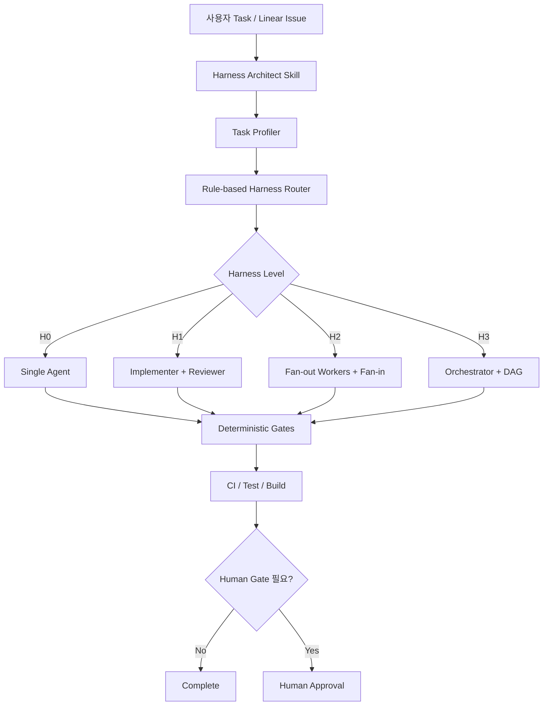
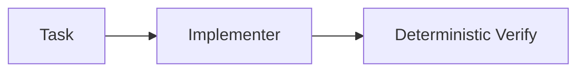
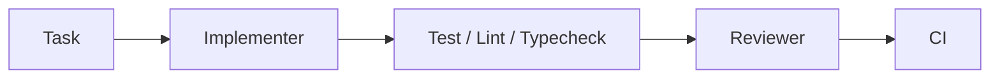
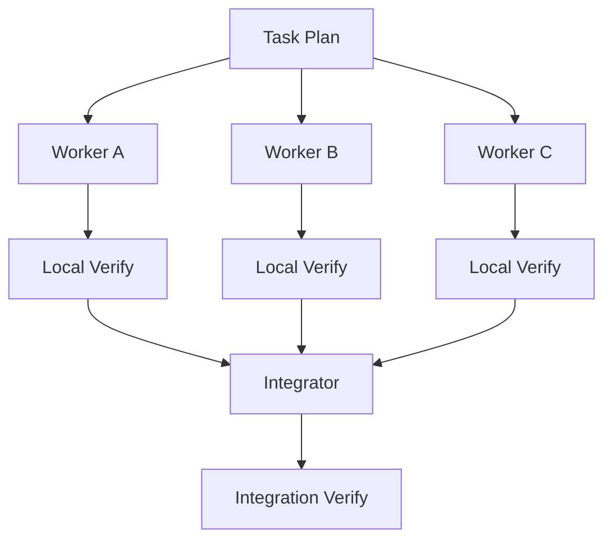
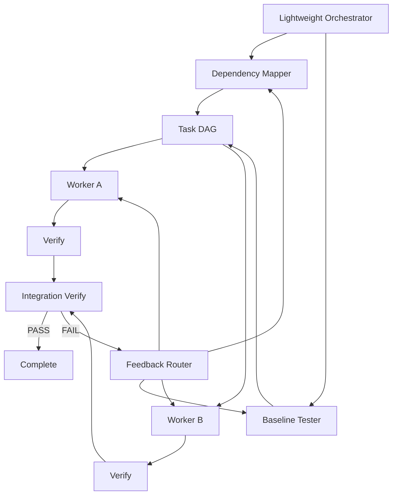
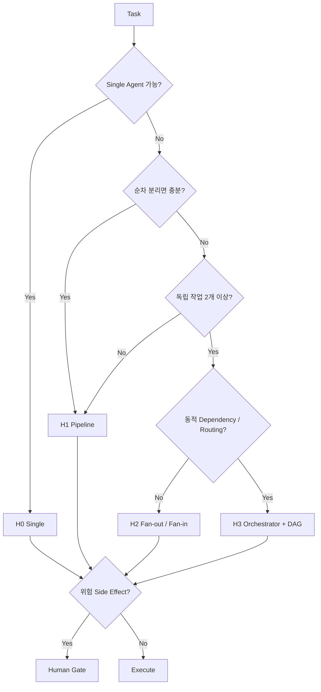
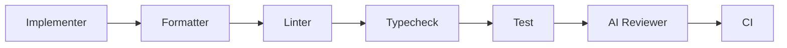
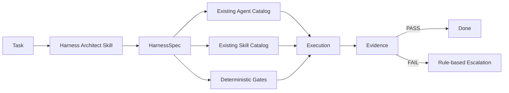

**별도의 “Harness Orchestrator Agent”를 항상 띄우는 방식보다는, 먼저 `Harness Architect Skill`을 만들고 이 Skill이 작업을 분류해 필요한 경우에만 Agent/Orchestrator를 승격시키는 구조**가 가장 효율적입니다.

이유는 명확합니다. 기존 정리에서도 `Single Agent → Pipeline → Fan-out/Fan-in → Supervisor` 순으로 필요한 만큼만 복잡도를 높이는 것이 핵심이었고, 대부분의 작업은 1~2개 Agent면 충분했습니다.  또한 포매터·린터·테스트·빌드는 Agent가 아니라 실제 명령과 CI의 exit code가 판정하도록 분리하는 것이 토큰과 신뢰성 모두에서 유리합니다.

제가 추천하는 최종 형태는 **`Task → Harness Architect Skill → Harness Spec → Runtime`**입니다.

## 1. 핵심 구조: Skill이 “하네스를 설계”, Agent가 “실행”



여기서 중요한 것은 **Harness Architect 자체를 별도 Agent로 만들지 않는 것**입니다.

```text
Harness Architect Skill
= 분석 + 판정 + 구성안 생성

Implementer / Reviewer / Worker / Orchestrator
= 실제 작업 실행
```

즉 Skill은 일종의 **하네스 컴파일러**입니다.

---

# 2. `Harness Architect Skill`이 받아야 할 입력

사용자가 상세한 양식을 작성하게 하면 실제 사용성이 떨어집니다.

기본 입력은 자연어 하나면 충분하게 만드는 것이 좋습니다.

예:

> OpenWebUI에 Google OAuth 로그인 기능을 추가하고 기존 로그인에는 영향을 주지 않도록 해줘.

Skill이 나머지를 Repository에서 조사합니다.

최소 입력 모델은 다음 6개입니다.

```yaml
task:
  goal:
  scope:
  constraints:
  acceptance_criteria:
  known_risks:
  target_environment:
```

사용자가 `goal`만 줘도 나머지는 탐색해서 채우되, **결론이 달라지는 정보만 질문**합니다.

---

# 3. 가장 중요한 Task Profiler

여기서 LLM이 막연하게 "복잡하다"고 판단하면 안 됩니다.

다음 **6개 축만 판정**하도록 하는 것을 권합니다.

| 변수          | 질문                      | 하네스에 미치는 영향         |
| ----------- | ----------------------- | ------------------- |
| Scope       | 변경 영역이 몇 개인가?           | Agent 수             |
| Coupling    | 변경 사이 의존성이 큰가?          | DAG 필요성             |
| Parallelism | 독립 작업이 2개 이상인가?         | Fan-out             |
| Uncertainty | 기존 구조/동작이 불명확한가?        | Dependency/Baseline |
| Risk        | Auth·DB·보안·배포 등인가?      | Reviewer/Human Gate |
| Side Effect | Production·외부 시스템 변경인가? | Human Gate          |

순수 점수보다는 **Rule → Score 보조 방식**을 권합니다.

정교한 점수를 만드는 것보다 판정 규칙이 예측 가능하고 디버깅하기 쉽기 때문입니다.

---

# 4. Harness Level을 4개로 고정

Agent 조합을 무한히 만들지 않는 것이 핵심입니다.

## H0 — Single



적용:

* 작은 버그
* UI 문구
* 단일 함수
* 단순 API 수정
* 한 영역 내 변경

예:

> 버튼 색상 변경
> API 응답 필드 하나 추가

**Agent: 1**

---

## H1 — Pipeline

일반적인 기능 개발의 기본형입니다.



적용:

* 실제 행동 변경
* Regression 위험 존재
* 여러 파일 변경
* 독립 리뷰 가치가 있음

**Agent: 2**

기존 자료에서도 Implementer 1 + Reviewer 1 + 결정론적 검증이 최소 Agent 수와 검증 신뢰성 사이에서 가장 좋은 기본형으로 정리되어 있습니다.

저라면 **대부분의 일반 개발을 H1로 처리**합니다.

---

# 5. H2 — Fan-out / Fan-in

정말 독립적인 작업이 있을 때만 사용합니다.



조건은 엄격하게 둡니다.

```text
독립 실행 가능한 작업 >= 2
AND
동일 파일 수정 충돌 가능성 낮음
AND
병렬화로 실제 시간 절약 가능
```

그리고 기본:

```yaml
max_workers: 3
```

을 추천합니다.

4~5개 이상부터는 Agent 간 Context 전달과 Merge 비용이 병렬화 이득을 잠식하기 쉽습니다.

---

# 6. H3 — Orchestrator + DAG

이 단계는 자동으로 쉽게 선택되지 않도록 해야 합니다.



사용 조건:

```text
독립 작업 존재
+
작업 간 Dependency 존재
+
실패 원인별 재라우팅 필요
+
단순 Pipeline으로 표현하기 어려움
```

리팩터링/마이그레이션 자료에서도 Dependency와 Baseline은 병렬 수행할 수 있지만 의존 작업에는 DAG가 필요하며, Verification 실패 역시 원인에 따라 Dependency Mapper·Baseline Tester·Worker·Orchestrator로 돌려보내야 한다고 정리되어 있습니다.

그리고 가장 중요한 규칙:

> **Orchestrator는 코드를 쓰지 않습니다.**

자료의 5페이지에서도 Orchestrator 책임을 상태·다음 Agent 선택·Dependency·분배·결과 수집·Feedback Routing·Human Gate로 제한하고, 코드 수정·테스트 작성·Migration 수행은 하지 않는 구조를 권합니다.

---

# 7. 실제 Harness Router 판정 알고리즘

`SKILL.md`의 핵심은 사실상 이것이면 됩니다.

```text
STEP 1
Single Agent로 한 세션 안에 안전하게 처리 가능한가?

YES → H0
NO  ↓


STEP 2
단순 순차 분리 + 독립 Reviewer면 충분한가?

YES → H1
NO  ↓


STEP 3
독립적인 작업 단위가 2개 이상 존재하는가?

YES → H2 후보
NO  → H1


STEP 4
작업 간 Dependency / Feedback Routing이 필요한가?

NO  → H2
YES → H3


STEP 5
Production / Secret / Destructive Migration / External mutation?

YES → Human Gate 추가
```

이 판정트리가 핵심입니다.



이전 정리의 `Single → Pipeline → Fan-out → Supervisor` 승격 원칙을 그대로 자동화하는 셈입니다.

---

# 8. Agent를 매번 새로 만들지 말고 Catalog에서 선택

이 부분이 토큰 절약에 상당히 중요합니다.

나쁜 방식:

```text
Task 입력
↓
LLM이 Agent 역할 7개 새로 설계
↓
각 Agent용 프롬프트 생성
↓
실행
```

매번 역할 정의에 토큰을 소비하고 결과도 흔들립니다.

좋은 방식:

```text
Task
↓
Harness Architect
↓
기존 Agent Catalog에서 선택
```

최소 Catalog를 **7개 이하**로 고정할 것을 권합니다.

| Agent               | 책임                |
| ------------------- | ----------------- |
| `implementer`       | 일반 구현             |
| `reviewer`          | 의미적 코드 리뷰         |
| `dependency-mapper` | 영향/의존성 분석         |
| `baseline-tester`   | 기존 동작 고정          |
| `integrator`        | 병렬 작업 통합          |
| `orchestrator`      | DAG·state·routing |
| `deployment-agent`  | 배포 작업             |

그리고 Security 같은 것은 기본적으로 Agent를 추가하지 않고:

```text
reviewer
+
security-review Skill
```

처럼 **Skill로 주입**하는 편이 좋습니다.

Superpowers 역시 `writing-plans`, `dispatching-parallel-agents`, `requesting-code-review`, `systematic-debugging` 등을 별도 Agent가 아니라 조합 가능한 Skill로 구성하는 접근을 사용합니다.

---

# 9. Agent보다 Skill을 우선하는 규칙

Harness Architect에 다음 판정도 넣으면 좋습니다.

```text
새 역할이 필요한가?
      │
      ├─ 반복되는 Procedure인가?
      │       ↓
      │     Skill
      │
      └─ 독립적인 책임/판단/완료조건인가?
              ↓
            Agent
```

예:

```text
systematic-debugging → Skill

security-review → Skill

TDD → Skill

release-check → Skill
```

반면:

```text
Implementer → Agent

Independent Reviewer → Agent

Orchestrator → Agent
```

가 적합합니다.

이렇게 해야 Agent가 폭증하지 않습니다.

---

# 10. Deterministic Gate는 자동 삽입

Harness Architect는 Agent 구성만 만들면 안 됩니다.

**Agent 없이 해결할 수 있는 일을 먼저 제거**해야 합니다.

예를 들어 TypeScript 프로젝트를 탐지하면:

```yaml
deterministic_gates:
  fast:
    - format-check
    - lint
    - typecheck

  feature:
    - unit-test

  final:
    - integration-test
    - build
```

구조를 생성합니다.



즉 Reviewer에게

> "Lint 문제 찾아봐"

라고 하지 않습니다.

실제 검증 명령의 exit code를 진실의 원천으로 사용하는 것이 기존 하네스 원칙입니다.

---

# 11. Context Budget까지 Skill이 결정해야 합니다

Harness 자동화에서 이 부분이 빠지면 토큰 절약 효과가 절반으로 줄어듭니다.

각 Agent마다:

```yaml
context:
  required:
  optional:
  forbidden:
```

를 생성하세요.

예를 들어:

```yaml
agent: reviewer

context:
  required:
    - task
    - acceptance_criteria
    - git_diff
    - test_results

  optional:
    - affected_architecture_doc

  forbidden:
    - full_repository_dump
    - unrelated_docs
```

Dependency Mapper라면:

```yaml
required:
  - relevant_module_tree
  - imports
  - call_sites
  - API contracts
```

Baseline Tester라면:

```yaml
required:
  - existing_tests
  - current_behavior
  - API responses
```

이전 자료에서도 Worker마다 전체 Repository를 반복해서 읽히지 말고 관련 Context만 분리해 제공하는 것이 토큰 절약의 핵심으로 정리되어 있습니다.

OpenViking의 L0 → L1 → L2 점진적 Context 로딩 방식 역시 같은 원리를 사용합니다.

---

# 12. Verify–Generate Deadlock도 Skill이 자동 방지

자동 Harness Generator라면 반드시 포함해야 합니다.

기본값:

```yaml
review:
  severity:
    blocker: must_fix
    major: must_fix
    minor: advisory
    nit: ignore_for_gate

  max_fix_loops: 2

  escalation_after: 2
```

저라면 일반 개발에서:

```text
MAX_REVIEW_LOOPS = 2
```

를 기본으로 하고,

고위험 변경만:

```text
MAX_REVIEW_LOOPS = 3
```

로 올리겠습니다.

Reviewer가 스타일이나 새 개선 아이디어를 계속 생산하면서 무한 루프를 만드는 일을 막기 위해서입니다.

---

# 13. 가장 중요한 산출물: `HarnessSpec`

Skill의 최종 결과는 설명문이 아니라 **구조화된 계약**이어야 합니다.

예:

```yaml
harness_version: 1

task:
  type: feature
  risk: medium
  uncertainty: low

harness:
  level: H1
  pattern: pipeline

agents:
  - id: implementer
    responsibility: implement requested behavior

  - id: reviewer
    responsibility: correctness and regression review

skills:
  implementer:
    - test-driven-development

  reviewer:
    - code-review

context:
  implementer:
    - task
    - relevant_source
    - relevant_tests

  reviewer:
    - task
    - acceptance_criteria
    - git_diff
    - test_results

verification:
  local:
    - lint
    - typecheck
    - test

  final:
    - build
    - ci

review_policy:
  blocking:
    - BLOCKER
    - MAJOR

  max_loops: 2

parallelism:
  enabled: false
  max_workers: 1

human_gate:
  required: false

escalation:
  if_hidden_dependency: dependency-mapper
  if_baseline_unknown: baseline-tester
  if_implementation_error: implementer
```

이 파일 하나가 **현재 작업의 실행 계약**이 됩니다.

---

# 14. 추천 디렉터리 구조

도구 종속성을 최소화한다면 개념적으로 다음 정도가 좋습니다.

```text
harness/
├── SKILL.md
│
├── rules/
│   ├── routing.md
│   ├── risk.md
│   └── context-budget.md
│
├── catalog/
│   ├── agents.md
│   └── skills.md
│
├── schemas/
│   └── harness-spec.yaml
│
└── examples/
    ├── h0-single.yaml
    ├── h1-pipeline.yaml
    ├── h2-fanout.yaml
    └── h3-orchestrator.yaml
```

그리고 Repository 공통 원칙만 `AGENTS.md`에 둡니다.

```text
AGENTS.md
→ Harness Architect Skill 사용 원칙
→ Agent 수 최소화
→ 결정론적 검증 우선
→ Human Gate 규칙
```

세부 orchestration 로직 전체를 `AGENTS.md`에 넣는 것은 피하는 것이 좋습니다. `AGENTS.md`는 공통 실행 계약/맵으로 유지하고 도구별 상세는 별도 위치로 분리하는 방식이 현재 자료의 원칙과도 일치합니다.

---

# 15. 실제 사용 모습

사용자는 그냥 이렇게 말합니다.

> 사용자 프로필 페이지에 프로필 이미지 업로드 기능을 추가해줘.

그러면 Harness Architect가 내부적으로:

```text
Scope      = FE + API + Storage
Coupling   = medium
Parallel   = low
Risk       = medium
Uncertainty= low
SideEffect = low
```

라고 판단하고:

```yaml
level: H1
pattern: pipeline

agents:
  - implementer
  - reviewer

gates:
  - lint
  - typecheck
  - unit-test
  - build

max_review_loops: 2
```

를 선택합니다.

반면:

> 인증 시스템을 JWT에서 OAuth 기반으로 전환하면서 기존 세션과 DB도 마이그레이션해줘.

라면:

```text
Scope       = Auth + API + DB + Session
Coupling    = high
Parallel    = medium
Risk        = high
Uncertainty = high
SideEffect  = high
```

그래서:

```yaml
level: H3

agents:
  - orchestrator
  - dependency-mapper
  - baseline-tester
  - implementer
  - reviewer

workflow:
  type: dag

human_gate: true
```

로 승격합니다.

---

# 16. 한 가지 더 개선한다면: “최소 하네스 우선”을 Hard Rule로

이 Skill의 최상위 규칙은 이것이어야 합니다.

```text
Always choose the least complex harness
that can safely complete the task.
```

그리고 다음을 명시적으로 금지합니다.

```text
DO NOT:
- create an Agent when a Skill is sufficient
- create a Skill when a script is sufficient
- use an AI reviewer for deterministic checks
- use parallel workers without independent work units
- use a Supervisor unless coordination is necessary
- give every Agent the full repository context
```

이 규칙이 사실상 **Over-Orchestration 방지 장치**입니다.

---

## 최종 추천 구조

제가 구현한다면 **1단계 MVP를 `Harness Architect Skill + Agent Catalog + HarnessSpec` 세 부분만으로 시작**하겠습니다.



**처음부터 별도 Harness Orchestrator Agent를 만드는 것은 권하지 않습니다.** Harness Architect는 Skill로 두고, **H3로 판정된 작업에서만 `orchestrator` Agent를 활성화**하십시오. 이것이 토큰 비용, 유지보수성, 예측 가능성, 디버깅 가능성을 가장 잘 균형 잡는 구조입니다.

가장 먼저 할 다음 작업은 **`Harness Architect SKILL.md v0.1`과 `HarnessSpec YAML schema`를 실제로 작성하고, Small/Medium/Migration 3개 작업을 넣어 H0/H1/H3 판정이 기대대로 나오는지 eval하는 것**입니다.
