**개발 전 단계에 하나의 멀티에이전트 패턴을 적용하면 오히려 비효율적**입니다. 첨부 그림의 문제의식처럼, 작업 복잡도보다 오케스트레이션 구조가 크면 감독·전달·중복 분석에 토큰이 더 많이 쓰입니다.

가장 효율적인 원칙은 다음입니다.

> **Single Agent → Pipeline → Fan-out/Fan-in → Supervisor 순으로, 필요한 순간에만 복잡도를 올린다.**
> 그리고 Formatter·Linter·Test·CI처럼 기계가 판정할 수 있는 것은 Agent에게 맡기지 않습니다.

## 1. 전체 개발 라이프사이클 권장 구조

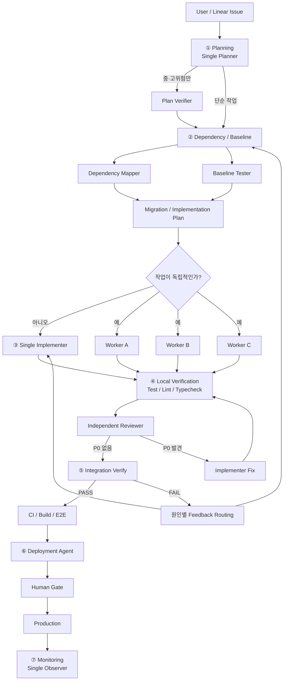

핵심은 **단계마다 에이전트 수가 달라진다**는 것입니다.

---

# 2. 단계별 최적 패턴

| 개발 단계               | 권장 형태                 | Agent 수 | 이유              |
| ------------------- | --------------------- | ------: | --------------- |
| 요구사항 정리             | Single Agent          |       1 | 전달 비용이 더 큼      |
| 계획 수립               | Single → 선택적 Verify   |     1~2 | 중요한 계획만 독립 검증   |
| Dependency/Baseline | Fan-out → Fan-in      |       2 | 서로 독립적으로 조사 가능  |
| 구현                  | Single 또는 Worker Pool |     1~3 | 독립 Task만 병렬화    |
| 코드 검증               | Generate–Verify       |       2 | 작성자와 검증자 분리     |
| 기계 검증               | Deterministic Gate    |       0 | Agent 불필요       |
| 통합                  | Fan-in                |       1 | 여러 결과를 한 곳에서 결합 |
| 배포                  | Single + Human Gate   |       1 | 병렬화 효용 거의 없음    |
| 운영 감시               | Single Observer       |       1 | 이상 발생 시에만 확장    |

여기서 가장 중요한 부분은 **Agent 수가 항상 5개, 10개가 아니라 대부분의 시간에는 1~2개라는 점**입니다.

---

# 3. ① 요구사항·Planning — Single Agent가 가장 효율적

예를 들어:

```text
"로그인 기능에 Google OAuth를 추가한다."
```

이 정도 작업에

```text
Planner
↓
Architect
↓
Requirement Reviewer
↓
Supervisor
```

까지 두는 것은 낭비입니다.

권장:

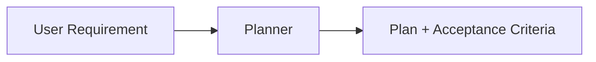

Planner 한 명이 다음만 정리합니다.

```text
Goal
Scope
Non-goal
Acceptance Criteria
Test
```

### 고위험 작업일 때만

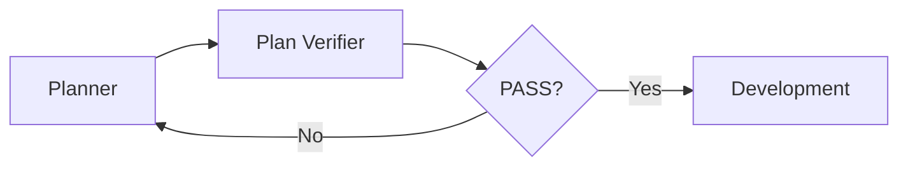

이것이 **Pipeline** 패턴입니다.

여기서도 Supervisor는 필요 없습니다.

---

# 4. ② Dependency + Baseline — Fan-out/Fan-in이 효율적

레거시 수정이나 Migration에서는 두 가지 조사가 필요합니다.

```text
A. 무엇과 연결되어 있는가?
B. 현재 정상 동작은 무엇인가?
```

둘은 상당 부분 독립적입니다.

따라서:

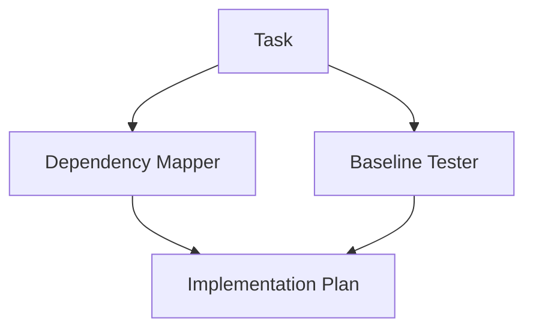

이때가 **Fan-out → Fan-in**을 쓰기 좋은 대표적인 구간입니다.

예:

```text
Dependency Mapper
→ 호출 관계
→ DB dependency
→ API 영향범위

Baseline Tester
→ 기존 테스트
→ 현재 API 응답
→ Characterization Test
```

둘이 각각 조사한 뒤 **결과만 합칩니다.**

### 토큰 절약 포인트

두 Agent 모두 전체 Repository를 읽게 하지 않습니다.

```text
Dependency Mapper
→ src/service + API 관련 파일

Baseline Tester
→ tests + 실제 실행 결과
```

처럼 Context를 분리합니다.

---

# 5. ③ 구현 — 기본은 Single Implementer

여기가 Over-Orchestration이 가장 쉽게 발생합니다.

작은 기능인데:

```text
Supervisor
├── Backend Agent
├── Frontend Agent
├── DB Agent
├── Test Agent
└── Documentation Agent
```

를 만드는 것은 대개 비효율적입니다.

### 기본 구조

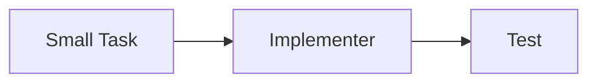

하나의 Implementer가:

```text
Inspect
→ Implement
→ Focused Test
→ Self Review
```

까지 처리합니다.

---

# 6. 독립 Task가 여러 개일 때만 Worker Pool

예를 들어 다음 세 기능이 서로 독립적이라면:

```text
MIG-101 User Repository
MIG-102 Cache Adapter
MIG-103 Logging
```

병렬 처리가 의미가 있습니다.

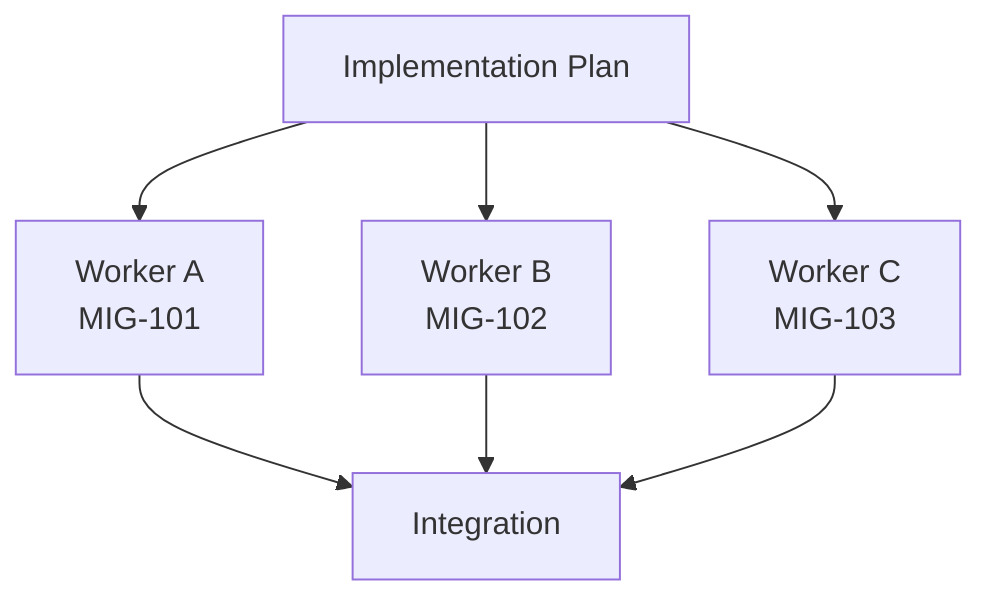

이것이 **Fan-out/Fan-in**입니다.

하지만 다음처럼 Dependency가 있으면:

```text
MIG-101
 ├─ MIG-102
 └─ MIG-103
       ↓
    MIG-104
```

DAG로 제어합니다.

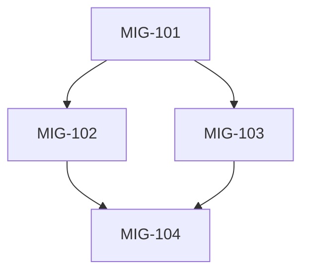

**Supervisor Agent가 매번 명령을 주고받을 필요는 없습니다.**

Task state와 Dependency만 있으면 됩니다.

---

# 7. ④ 검증 — Generate–Verify는 여기서만 강력합니다

첨부하신 이전 그림의 Verify–Generate Deadlock이 발생하는 구간이기도 합니다.

권장 구조:

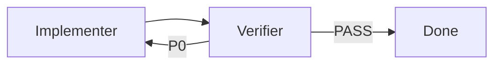

하지만 중요한 제한을 둡니다.

```text
P0 = 반드시 수정
P1 = 권고
P2 = 선택

P0만 Loop 차단 조건

MAX_REVIEW_LOOP = 2~3
```

즉:

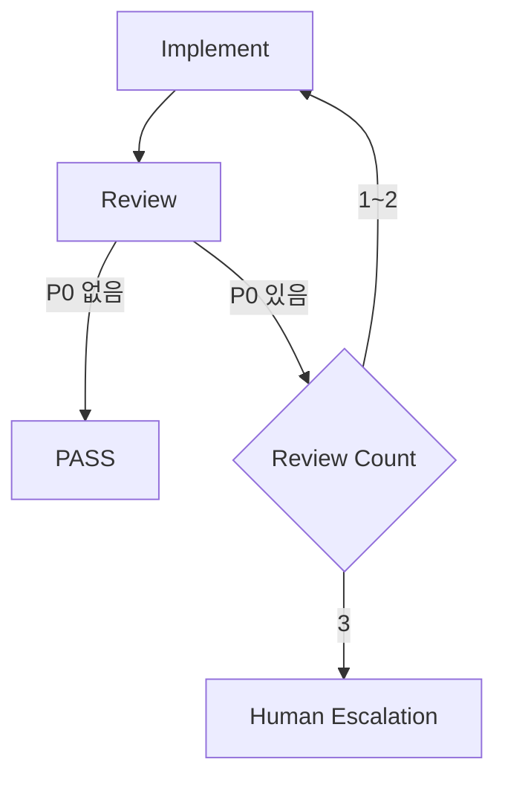

이렇게 해야 **Generate–Verify Deadlock**을 막을 수 있습니다.

---

# 8. Agent보다 먼저 Deterministic Gate를 둡니다

이 부분이 토큰 절약에서 가장 중요합니다.

다음 작업을 Reviewer Agent에게 시키면 안 됩니다.

```text
코드 포맷이 맞는가?
TypeScript type error가 있는가?
Unit Test가 통과하는가?
Build가 성공하는가?
```

Agent를 쓰지 말고:

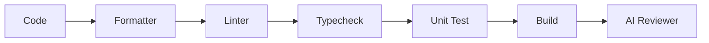

순으로 합니다.

Reviewer가 받는 Context는:

```text
Task
+
git diff
+
Test results
+
CI results
```

정도로 제한합니다.

전체 Repository를 다시 읽게 할 필요가 없습니다.

따라서 토큰 비용은 상당히 줄어듭니다.

---

# 9. ⑤ Integration — Fan-in Agent 1개

여러 Worker의 결과를 다시 Specialist 여러 명이 읽기 시작하면 비용이 폭증합니다.

통합은 **한 명**이면 충분합니다.

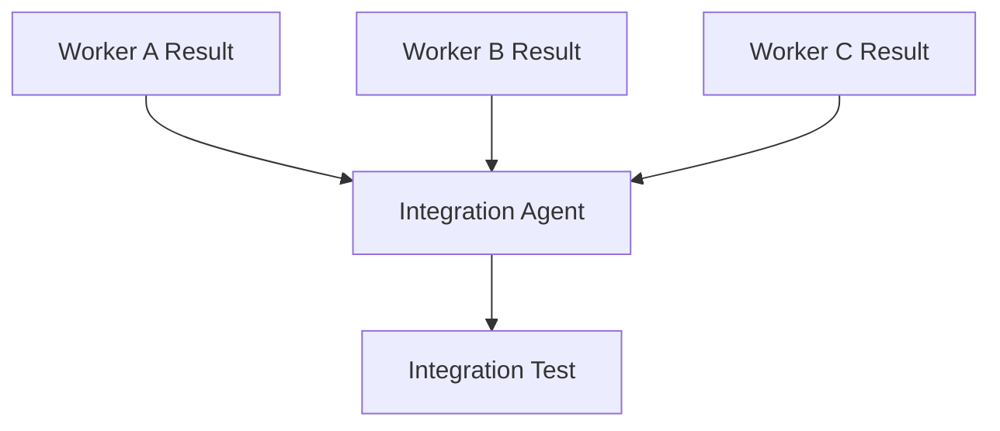

Integration Agent의 역할은 코드를 새로 만드는 것이 아니라:

```text
Interface mismatch
Dependency conflict
Regression
Merge conflict
```

정도만 확인합니다.

---

# 10. Supervisor는 언제 필요한가?

첨부 이미지의 핵심 질문 중 하나입니다.

> "병렬화에 조정까지 필요한가?"

다음 정도가 되어야 Supervisor가 가치가 있습니다.

```text
독립 Task가 여러 개
+
순서 Dependency 존재
+
Agent가 3개 이상
+
결과를 동적으로 재분배해야 함
```

예:

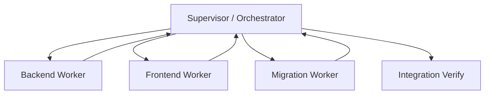

반대로 단순한 작업에 Supervisor를 넣으면:

```text
User
↓
Supervisor
↓
Worker
↓
Supervisor
↓
Reviewer
↓
Supervisor
↓
User
```

가 되어 **실제 일을 하지 않는 Agent가 가장 많은 토큰을 소비**하게 됩니다.

첨부 이미지가 지적하는 것이 바로 이것입니다.

---

# 11. Hierarchical Delegation은 정말 큰 작업에서만

다음 구조는 멋있어 보이지만 매우 비쌉니다.

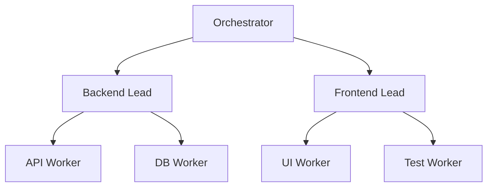

각 단계마다:

```text
Context 전달
결과 요약
재해석
상태 업데이트
```

가 발생합니다.

작은·중간 규모 프로젝트에서는 거의 필요 없습니다.

---

# 12. 배포는 Single Agent + Human Gate

Deployment도 멀티에이전트가 필요한 영역처럼 보이지만 대부분 그렇지 않습니다.

권장:

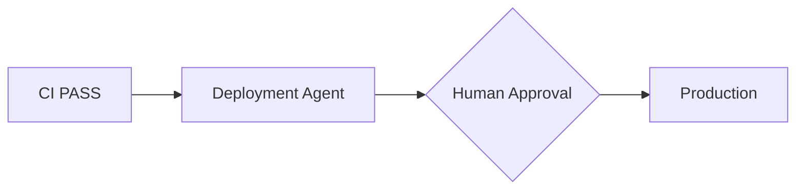

Deployment Agent가:

```text
Release artifact 확인
Backup 확인
Deploy
Health check
Rollback 준비
```

를 수행하면 충분합니다.

Production 변경을 판단하는 별도의 Supervisor Agent는 대개 필요하지 않습니다.

---

# 13. 최종적으로 권하는 Adaptive Architecture

개발 Harness 전체를 하나의 구조로 보면 다음이 가장 효율적입니다.

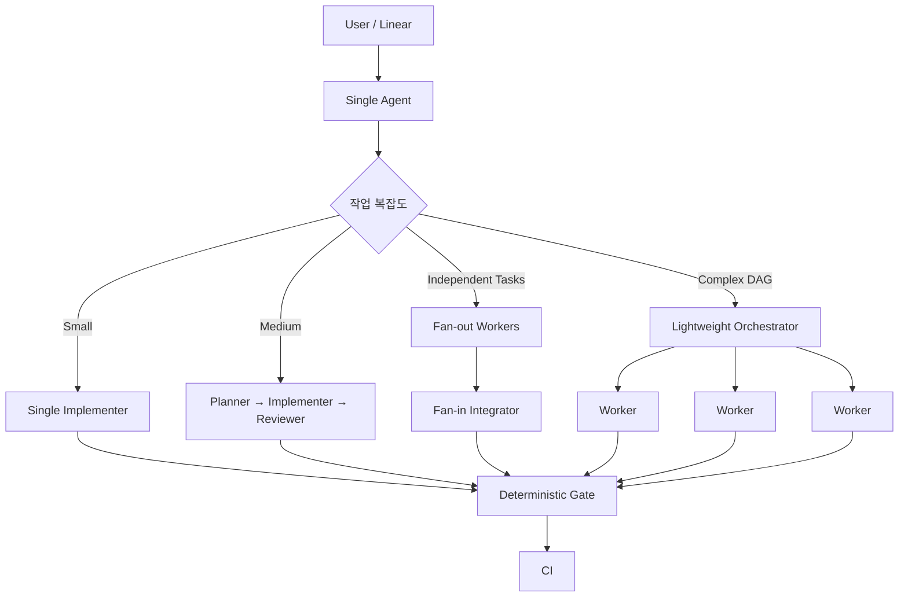

여기서 가장 중요한 것은 **처음부터 Orchestrator로 시작하지 않는 것**입니다.

---

# 14. 실무용 결정 규칙

저라면 Harness에 다음 4단계 판정만 넣겠습니다.

```text
1. Single Agent로 가능한가?
        ↓ No

2. 순차 전문가 분리만 필요한가?
        ↓ Yes
   Pipeline
        ↓ No

3. 독립 작업을 동시에 할 수 있는가?
        ↓ Yes
   Fan-out / Fan-in
        ↓ No

4. 병렬 작업 사이에 동적 조정까지 필요한가?
        ↓ Yes
   Supervisor / Orchestrator
```

즉 첨부 이미지의 질문 순서가 사실상 **좋은 Agent Architecture 선택 알고리즘**입니다.

---

## 추천하는 기본형

현재 일반적인 Vibe Coding 프로젝트라면 저는 다음 정도를 기본으로 잡겠습니다.

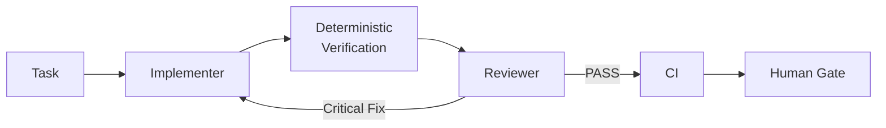

그리고 **작업이 실제로 병렬화 가능한 경우에만**:

```text
Implementer
```

를

```text
Worker A
Worker B
Worker C
        ↓
Integrator
```

로 확장합니다.

이 방식이면 **대부분의 개발에서는 1~2 Agent만 사용하고, 실제 병렬화 이익이 있는 순간에만 3~4개로 늘어나므로 토큰·지연시간·Context 전달 비용을 동시에 줄일 수 있습니다.**

개발 속도와 비용 측면에서 가장 먼저 적용할 한 가지는 **`Single → Pipeline → Fan-out → Supervisor`의 승격 조건을 `AGENTS.md`나 Orchestrator 규칙에 명시하여, Agent가 임의로 팀을 확장하지 못하게 하는 것**입니다.
