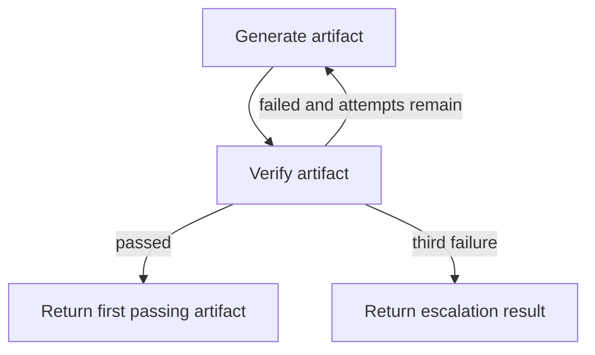

# Bounded retry control

`ex-08-15-max-retries-code/run/max_retries.py` is a standard-library executable realization of a retry safety pattern. `MAX_RETRIES = 3`; `generate_with_retries(spec, generator, verifier)` calls `generator.run`, verifies the artifact, logs the attempt, and returns immediately on the first passing result. It does not raise when all attempts fail: it returns `escalated: 3회 실패, 수동 개입 필요`.

This flow shows the three-attempt cap and distinct success/exhaustion outcomes.

`CodeGenerator` is intentionally a stub: in `success`, its internal counter makes the second generated artifact `artifact_v2_good`; in `fail`, every artifact is bad. `TestRunner` only checks whether the name contains `good`. The loop variable is zero-based (`attempt` 0, 1, 2), while the printed trace uses `attempt + 1`, so logs are numbered 1/3, 2/3, and 3/3. Each iteration calls each stub once. The early return after log 2/3 explains why success makes two calls and never reaches attempt three; `run/log_success.txt` is the supplied expected trace for that path. Failure makes three generator/verifier calls, then returns escalation after log 3/3; `run/log_escalated.txt` is the supplied expected trace. Those files are demonstration artifacts, not tests. Run `python3 run/max_retries.py success` and `python3 run/max_retries.py fail` from the exercise directory; both supported scenarios return process status 0 even when the latter returns escalation. Invalid scenarios print `unknown scenario: <value>. expected 'success' or 'fail'` and return status 2. No automated test asserts counts, escalation, or CLI statuses.

For real use, replace the generator and verifier, not the cap/early-return structure. Ensure verifier failures are represented as a result and that downstream callers handle the escalation string or replace it with a typed escalation result.