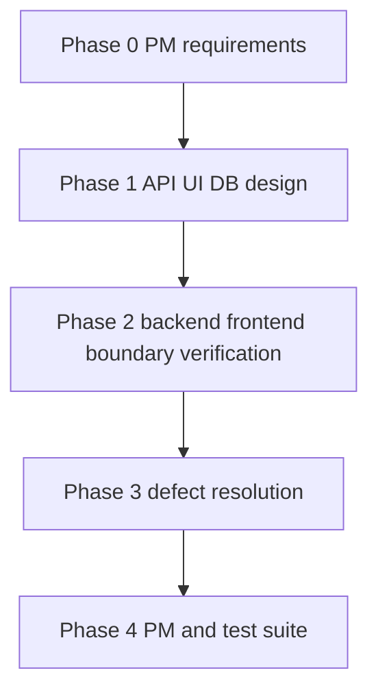

# Eight-agent full-stack team

`ex-12-03-team-8-agents` is a static set of Claude Code agent definitions, not an executable application or coordinator. `00_team_table.md` assigns product management, API/UI/database design, backend/frontend implementation, boundary verification, and test-suite duties. `01_phase_matrix.md` makes the concurrency constraint explicit.

This is the declared activation sequence, not a runnable coordinator.

## Authority and lifecycle

`feature-pm` owns all phases and has team-management tools. In Phase 1, `api-designer`, `ui-designer`, and `db-migrator` write design artifacts but lack `Edit`. In Phases 2–3, only `backend-impl` and `frontend-impl` have `Edit`/`Bash`; `boundary-verifier` reads and cross-checks API-to-hook data, routing, and state transitions, then asks implementers to fix issues. In Phase 4, `test-suite` creates E2E/regression work and receives only from PM; it has no `SendMessage`.

At most three workers plus PM are active in Phases 1–3, for a four-person ceiling. Phase 0 is PM-only and Phase 4 has PM plus test suite. A request to activate five or more agents must be answered by splitting the session or delaying some agent starts. Do not activate all eight merely because definitions exist.

## Boundary contract and escalation

`boundary-verifier` evaluates response wrapping, case conversion, file-path/href correspondence, state transition, hook mapping, sync-versus-async behavior, and optional fields. Its only verdicts are `PASS`, `FIX`, and `REDO`; it cannot edit. Two REDOs for one boundary force operational continuation as PASS, notify PM with `[MANUAL_INTERVENTION_REQUIRED]`, and record the boundary/reason in `manual_queue.md`. That forced PASS is a scale-control escalation, not evidence of correctness.

## Missing runtime inputs

The agent definitions refer repeatedly to `_workspace/features/{name}/00_requirements.json`; `feature-pm` is supposed to create it in Phase 0. No such file, feature implementation, generated design document, API route, test, or coordinator is tracked. In particular, `test-suite`'s instruction to map five requirements to E2E scenarios is a declared future workflow, not a currently verifiable five-item test plan. It is PM-invoked only, uses MSW for deterministic isolation, gates on `npm test`, and on any E2E failure returns `[BLOCKER.]` to PM then stops without implementation edits. Its handlers and integration summary are likewise outputs specified by agents rather than files that can run today.

For a live implementation, establish the requirements schema and fixture first, then create the coordinator and tests that exercise Phase 1 agreement, Phase 2 FIX/REDO routing, two-REDO escalation, and Phase 4's PM-only test-suite invocation. Validate static topology changes now by reconciling every agent frontmatter tool list with the table and phase matrix.
