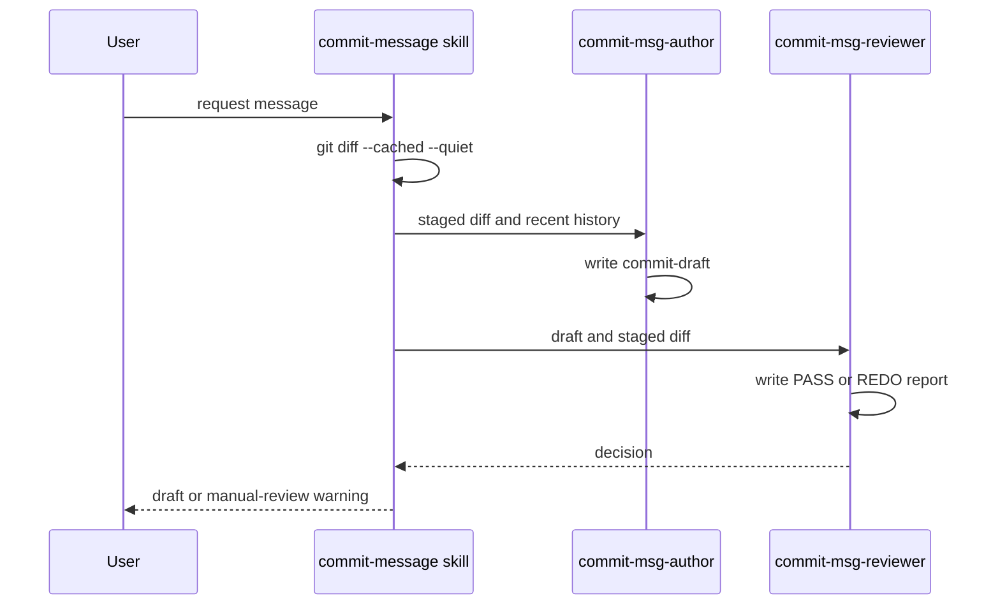

# Commit-message harness

`ex-02-02-my-first-harness` is a minimal sequential harness. `commit-message/SKILL.md` activates for commit-message requests but explicitly does not replace an already-written `git commit -m`. It turns staged changes into `_workspace/commit-draft.md` and a decision in `_workspace/review-report.md`.

This sequence is the on-disk workspace protocol specified by the skill.

## Contract and invariants

The precondition is semantic: `git diff --cached --quiet` exit code 1 means staged changes exist; exit code 0 stops with a `git add` instruction. The author reads `git diff --cached` and the latest ten commits, writes an imperative Conventional Commit subject of at most 72 characters plus at most three body lines, and must not describe unstaged or imagined change.

The reviewer checks `type(scope): subject`, length, and factual alignment with the staged diff. It emits `PASS` or `REDO`; uncertain cases prefer `REDO`. On REDO, the skill supplies the review report's concrete modification instruction in the next author prompt, then re-runs review. The skill allows at most two author re-calls and says a final unresolved REDO returns the latest draft plus a manual-review warning, preventing an unbounded loop.

## Retry-policy inconsistency

The reviewer contract separately says that after two regenerations it must record a warning and force `PASS`, whereas the skill's loop contract says to terminate after exceeding two re-calls with a manual-review warning and the last draft. These outcomes conflict: forced PASS versus unresolved-REDO fallback. No coordinator implementation resolves the conflict. Before executing or extending this harness, choose one canonical terminal policy and update both `commit-message/SKILL.md` and `commit-msg-reviewer.md`; do not infer that either behavior already wins.

## Safe changes

Keep `_workspace/commit-draft.md` and `_workspace/review-report.md` stable because they are the inter-agent API. Broaden a reviewer rule only with a matching author instruction and a fixture/report update. Focused validation is to stage a small known change and invoke the skill; inspect both workspace files and verify no message claims a change outside `git diff --cached`.