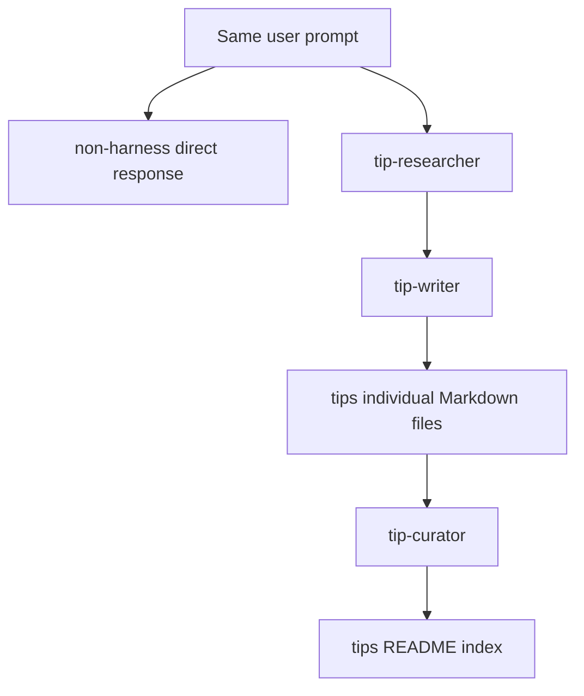

# Harness A/B comparison

`ex-02-01-ab-comparison` demonstrates the repository's core claim: the request `claude code 사용 팁 정리해주세요` is held constant while the execution environment changes. The direct case stores one free-form result in `non-harness/claude-code-tips.md`; the harnessed case stores a maintained collection under `apply-harness/tips/`, visualized by `index.html`.

This diagram shows the documented difference between the two experimental arms.

## Harnessed path

`apply-harness/.claude/agents/tip-researcher.md` has read/search tools and must return short, source-cited candidate items. `tip-writer.md` turns candidates into one `tips/<kebab-case>.md` document per tip using the situation → method → example → caution format. `tip-curator.md` checks frontmatter, format, title/file-name agreement, duplicates, and index coverage, then updates `tips/README.md`.

The three agents deliberately separate evidence collection, prose generation, and collection maintenance. The writer must not invent unverifiable material; the curator owns cross-document consistency rather than individual tip prose. The corresponding skills (`tip-collect`, `tip-format`, and `tip-publish`) are the shared procedural references named by those roles.

## Change surface and validation

Change an agent when its authority or artifact contract changes; change the corresponding skill when shared procedure/format changes. Preserve the writer/curator ownership boundary or index quality becomes an implicit responsibility of every author. Inspect `apply-harness/tips/README.md` and the tip frontmatter after changes; open `index.html` to check the intended comparison presentation. This is captured instructional output, not an automated end-to-end test.