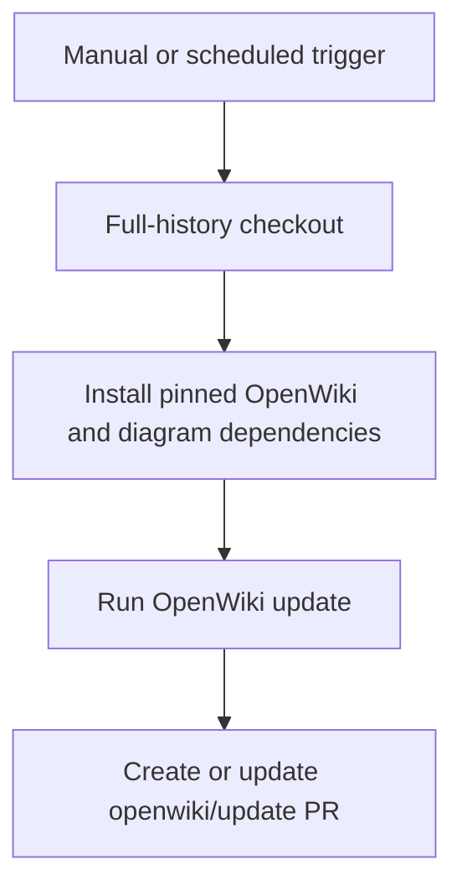

# OpenWiki update automation

`.github/workflows/openwiki-update.yml` runs manually or daily at `0 8 * * *`. It has `contents: write` and `pull-requests: write`, checks out full history with `fetch-depth: 0`, installs Node 22, globally installs pinned `openwiki@0.3.1`, `mermaid@11.16.0`, and `jsdom@29.1.1`, then executes `openwiki code --update --print`.

Full history is functional: the workflow explains that a shallow checkout hides the commit last documented by OpenWiki and creates an empty change summary. Mermaid and jsdom are optional upstream dependencies but are installed here for high-fidelity Mermaid validation.

## LangSmith configuration and credential boundary

`openwiki/.langsmith.json` configures one connector workspace. It selects project `harness-eng` and references its credential **by environment-variable name**: `OPENWIKI_LANGSMITH_API_KEY`. The workflow supplies that variable from the correspondingly named repository secret. This is connector authentication for the code-mode pull; the workflow comment establishes a numbered convention (`OPENWIKI_LANGSMITH_API_KEY_2`, `_3`, and so on) if further configured workspaces are added.

This is distinct from optional tracing of the OpenWiki workflow itself:

| Purpose | Workflow variables | Current meaning |
|---|---|---|
| OpenWiki model provider | `OPENWIKI_PROVIDER`, `OPENROUTER_API_KEY`, `OPENWIKI_MODEL_ID` | Selects OpenRouter and the configured model. |
| LangSmith connector pull | `OPENWIKI_LANGSMITH_API_KEY` | Authenticates the workspace declared in `.langsmith.json`, whose configured project is `harness-eng`. |
| Workflow tracing | `LANGSMITH_API_KEY`, `LANGCHAIN_PROJECT`, `LANGCHAIN_TRACING_V2` | Optionally traces this OpenWiki run; current project value is `openwiki`. |

Documentation and configuration must name secret variables only. Never print, add, log, or commit secret values. If adding a workspace, update `.langsmith.json` and the workflow environment mapping together, preserving the difference between connector credentials and tracing credentials.

## Pull request lifecycle

This diagram shows the GitHub Actions lifecycle defined in the workflow.

`peter-evans/create-pull-request` creates or updates `openwiki/update` with the fixed commit message and title `docs: update OpenWiki`. Its `add-paths` restricts the automated PR to `openwiki`, `AGENTS.md`, `CLAUDE.md`, and `.github/workflows/openwiki-update.yml`. A failed dependency installation, missing provider or connector secret, unavailable provider, or missing history means no trustworthy update: inspect Actions logs rather than weakening permissions or exposing credentials.

## Safe changes and validation

Review pinned action/dependency versions, environment-variable names, `.langsmith.json` project selection, and PR path scope as one operational surface. The narrow validation is `workflow_dispatch` in GitHub Actions followed by review of the generated PR diff. Confirm that connector authentication works without assuming tracing is required, and that no output exposes a secret value.
