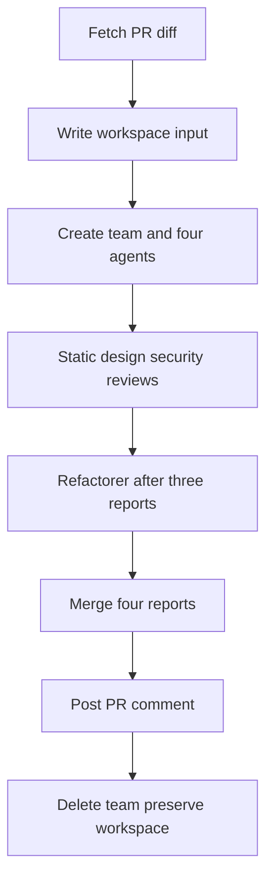

# PR review orchestration

The repository tracks two orchestration **specifications**, not a live review system. `ex-06-12-pr-review-skill-md/.claude/skills/pr-review-orchestrator/SKILL.md` defines a four-role review flow. `ex-11-05-orchestrator-6phase/.claude/skills/code-review-team/SKILL.md`, together with its four agent definitions, defines a six-phase team workflow; an identical `code-review-team/SKILL.md` is also tracked at `ex-11-06-jwt-pr-bugs/.claude/skills/code-review-team/SKILL.md` for the JWT mock-mode exercise. The latter source location is equally authoritative for the shared contract. It distinguishes official team operations (`TeamCreate`, `AgentTool`, `TaskCreate`, `SendMessage`, `TeamDelete`) from required implementation work: `parseDiff`, completion waiting, report merging, and the shell helper `$` are pseudocode.

This diagram is the specified lifecycle, not proof that its pseudocode APIs or GitHub CLI actions run in this repository.

## Six-phase contract

Phase 0 fetches `gh pr diff` and writes `_workspace/input/pr-{N}.diff`. Phase 1 creates a `code-review` team and isolated worktrees. Phase 2 assigns four artifacts; refactoring depends on the first three. Phase 3 fans static/design/security review out in parallel and permits evidence-directed peer `SendMessage`. Phase 4 bounds refactorer patch generation and peer revalidation. Phase 5 reads the four reports, priority-merges P0/P1/P2, posts with `gh pr comment`, deletes the team, and retains `_workspace/` for human inspection.

The leader does not author review prose; workers do. The specified skill must not `git commit` or merge a PR. A same-number rerun can overwrite workspace output, so a live implementation needs explicit overwrite policy. See [four review worker roles](reviewer-roles.md) for worker contracts.

## Missing exercise evidence

Several READMEs describe artifacts that are absent from tracked files:

- `ex-06-12` claims four agent stubs and `result/dry-run.md`; only the PR-review skill is tracked.
- `ex-11-03` claims a sample TypeScript PR, fixture directory, and mock result; only its static-analyzer definition and `run/` notes are tracked.
- `ex-11-04` claims three mock reports; only the four agent definitions and `run/` notes are tracked.
- `ex-11-05` claims `result/dry-run-log.md`; its four agents, orchestration skill, and `run/` checklists are tracked, but no result tree exists.

Do not validate these contracts by inspecting a phase log or report path that is absent. The [JWT exercise](jwt-fixture.md) has the same missing-fixture condition.

## Implement before live use

Implement checked shell execution, diff parsing, worker success/failure completion, P0/P1/P2 report merging, workspace creation and missing-report handling, `gh` failure policy, and overwrite-safe reruns. Then add tests for those failure paths and authenticated GitHub behavior. Until that point, validation is limited to static consistency: task dependencies, report filenames, tool boundaries, and agent handoff rules.
